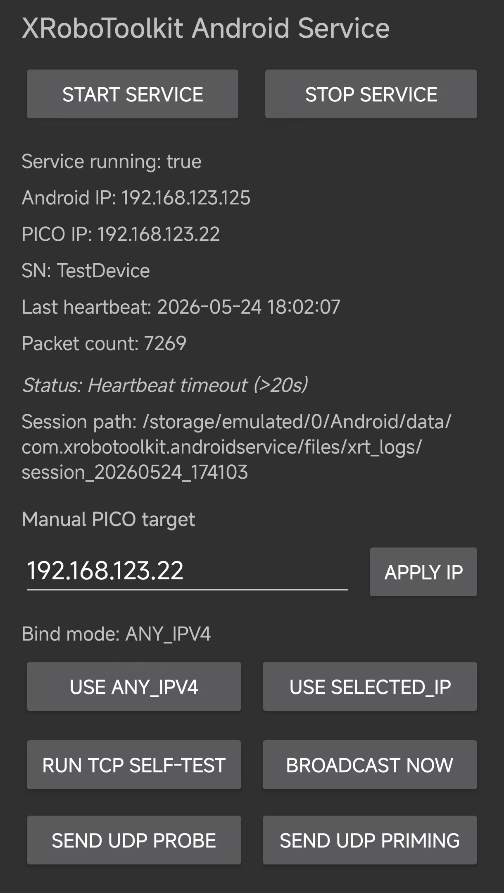

# XRoboToolkit-Android-Service

[](https://github.com/AuroRa8684/XRoboToolkit-Android-Service/releases/latest/download/XRoboToolkitAndroidService.apk)
[](https://github.com/AuroRa8684/XRoboToolkit-Android-Service/actions/workflows/release-apk.yml)
[](./LICENSE)

Android implementation of XRoboToolkit PC Service bridge.

This project is based on and inspired by:  
https://github.com/XR-Robotics/XRoboToolkit-PC-Service

## Download (One-Click)

- Latest APK:  
  https://github.com/AuroRa8684/XRoboToolkit-Android-Service/releases/latest/download/XRoboToolkitAndroidService.apk
- Release page:  
  https://github.com/AuroRa8684/XRoboToolkit-Android-Service/releases

## What It Does

- Starts an Android foreground service.
- Sends UDP discovery broadcast on port `29888`.
- Listens TCP on port `63901`.
- Accepts PICO connection and parses XRoboToolkit control packets.
- Shows runtime diagnostics in app UI (IP, bind mode, accept count, errors, recent events).
- Writes raw/events logs to local storage.

## Quick Start

1. Download and install `XRoboToolkitAndroidService.apk`.
2. Open the app and tap `Start Service`.
3. Keep `Bind mode` as `ANY_IPV4`.
4. In PICO XRobotToolKit, connect to your phone IP (same LAN).
5. Verify app UI updates: PICO IP, SN, heartbeat, packet count.

## App Screenshot



## Build Locally

```bash
./gradlew :app:assembleRelease
```

Generated APK:

```text
app/build/outputs/apk/release/app-release.apk
```

## Repository Release Automation

This repo includes GitHub Actions workflow:

- File: `.github/workflows/release-apk.yml`
- Trigger:
  - Push tag like `v1.0.0`
  - Manual `workflow_dispatch`
- Output artifact name:
  - `XRoboToolkitAndroidService.apk`

### How Maintainers Publish a New APK

```bash
git tag v1.0.0
git push origin v1.0.0
```

After workflow completes, the APK is attached to the GitHub Release and users can download it from the one-click link above.

## License

MIT License. See [LICENSE](./LICENSE).

---

## 中文说明（Chinese）

### 项目简介

这是 XRoboToolkit PC Service 的 Android 化实现，用于让 PICO 连接 Android 手机服务。

本项目基于并参考：  
https://github.com/XR-Robotics/XRoboToolkit-PC-Service

### 一键下载

- 最新 APK：  
  https://github.com/AuroRa8684/XRoboToolkit-Android-Service/releases/latest/download/XRoboToolkitAndroidService.apk

### 使用步骤

1. 安装 `XRoboToolkitAndroidService.apk`。  
2. 打开 App，点击 `Start Service`。  
3. 保持 `Bind mode = ANY_IPV4`。  
4. 在 PICO 的 XRobotToolKit 中输入手机 IP 并连接。  
5. 查看 UI 中的 `PICO IP / SN / Heartbeat / Packet count` 是否更新。  

### 发布流程（维护者）

推送 `v*` 标签后，GitHub Actions 会自动构建并上传 APK 到 Release。
